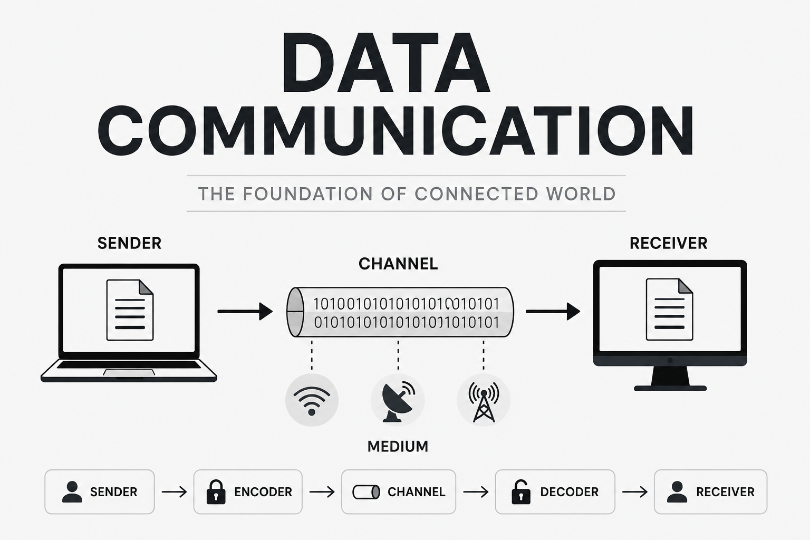

 

## Data Communication

**_Data Communication_** হলো দুই বা ততোধিক ডিভাইসের মধ্যে ডেটা বা তথ্য আদান-প্রদান করার প্রক্রিয়া, যা কোনো Transmission Medium(যেমন ক্যাবল, ফাইবার অপটিকস বা ওয়্যারলেস চ্যানেল) ব্যাবহার করে সম্পন্ন করা হয়। 
সহজ কথায় এটা হচ্ছে কম্পিউটার, মোবাইল বা যেকোনো ডিজিটাল ডিভাইসের মধ্যে তথ্য আদান-প্রদান করা। 

## 4 Fundamental Characteristics of Data Communication

**_Data Communication_** কার্যকর হওয়ার জন্য কিছু মৌলিক বৈশিষ্ট্য থাকতে হয় যেই জিনিসগুলো মূলত নির্ধারণ করে যে, একটা নেটওয়ার্ক কমিউনিকেশন কতটা Accurate, Fast এবং Reliable বা Stable ভাবে ডেটা আদান-প্রদান করতে পারে। 

এই ৪ টা মৌলিক বৈশিষ্ট্য হচ্ছে- 

1. Delivery
2. Accuracy
3. Timeliness
4. Jitter

এই ৪  টা জিনিস ব্যাখা করা যাক একটু-

## Delivery

**_Data Delivery_** বলতে বোঝায় ডেটা সঠিক গন্তব্যে(Destination) পৌছানো। 
এই জিনিসটা একটা এক্সাম্পল দিয়ে বোঝানো যাক- 
ধরেন আপনি আপনার গার্লফ্রেন্ডরে কোনো একটা মেসেজ পাঠাইছেন কিন্তু সেইটা তার কাছে না যেয়ে চলে গেছে অন্য আরেকজনের কাছে অথবা ধরেন কারো কাছেই গেলো না। তাহলে কি এইটারে সঠিক বা সফল কমিউনিকেশন বলা যাবে? অবশ্যই না। ডেটা কমিউনিকেশনে যখন আপনি কোনো একটা তথ্য একজনের কাছে পাঠাবেন তখন সেটা অবশ্যই যে ডিভাইস বা ব্যাবহারকারীর কাছে পাঠাতে চাচ্ছেন সেটা তার কাছেই পৌছাতে হবে। 

**_Special Note_**  
✅Right Data -> Right Destination

## Accuracy

**_Accuracy_** বলতে বোঝায় ডেটা Error-Free বা ক্রটিমুক্ত ভাবে গন্তব্যে পৌছানো। 
Data Transmission এর সময় অনেক কারনে ডেটা পরিবর্তিত হতে  পারে। যেমন- 

1. Electrical Noise
2. Weak Signal
3. Network Interference 
4. Hardware Problem

উপরের এই সমস্যাগুলোর কারনে Bit-Error হতে পারে। ডিজিটাল ডেটা মূলত  0 আর 1 এর সমন্বয়ে গঠিত। তাহলে ধরো তুমি একটা ডেটা পাঠাচ্ছো 0011101 কিন্তু ডেটা Destination এ যেয়ে পৌছাচ্ছে 1100111. 
যদি এমনটা হয় তাহলে তো ডেটা Corrupt হয়ে যাবে। এই জিনিসটাই মূলত Bit-Error. 

এই Bit-Error এর কারনে আমাদের অনেক সমস্যা হতে পারে। যেমন ডেটা যদি ভুল হয় তাহলে - 

1. File Corrupt হবে।
2. Misinformation পৌছাতে পারে।
3. অনেক গুরুত্বপূর্ন সিস্টেম ফেইল করতে পারে। 

 

**_Solution_**

Accuracy বজায় রাখতে নেটওয়ার্কে বিভিন্ন Error-Detection ও Correction Method ব্যাবহার করা হয়। যেমন- 

1. Checksum
2. Paritysum
3. CRC(Cyclic Redundancy Check)

 

**_Special Note_**  
✅Data Should arrive without Errors.

## Timeliness

**_Timeliness_** বলতে বোঝায় ডেটা সঠিক সময়ে তার গন্তব্যে পৌছানো। অনেক অ্যাপ্লিকেশনে ডেটা দেরিতে পৌছালে সেটি অকার্যকর হয়ে যায়।

অনেক অ্যাপ্লিকেশন Real-Time Communication ব্যাবহার করে। এইক্ষেত্রে Timeliness জিনিসটা অনেক গুরুত্বপূর্ণ। উদাহরন হিসাবে বলা যায়- 

- Video Call
- Live Streaming
- Online Trading

এইসব ক্ষেত্রে যদি ডেটা সময়মত না এসে দেরি করে আসে তাহলে ব্যাবহারকারীদের  Bad experience হতে পারে। 

উদাহরনস্বরুপ, আপনি একটা গুরুত্বপূর্ণ মিটিং করছেন বসের সাথে ভিডিও কলের মাধ্যমে। এইসময় দেখা গেলো আপনি যা বলতেছেন, আপনার বস সেইটা শুনছে ১০ সেকেন্ড পরে বা আপনাকে যেইটা বলছে সেইটা আপনি ৫ সেকেন্ড পরে শুনছেন। এইটাই Timeliness.

Timeliness জিনিসটা কিছু ফ্যাক্টরের উপরে নির্ভর করে। যেমন-

- Bandwidth
- Network Latency
- Distance Between Devices

 

**_Special Note_**   
✅Data must arrive when it's needed.

## Jitter

ডেটা যখন এক নেটওয়ার্ক থেকে অন্য নেটওয়ার্কে যায় তখন সেইটা Packet আকারে যায়। এই জিনিসটাকে বলে Packet Switching. এই প্যাকেট হচ্ছে আমাদের পাঠানো ডেটার-ই  Small, Independent Units. আরো একটু ডিটেইলসে বলা যাক- ধরেন আপনি একটা ডেটা এক জায়গা থেকে আরেক জায়গায় পাঠাবেন, তখন আপনার ডেটাকে ছোট ছোট অনেকগুলো আলাদা আলাদা ইউনিটে ভাগ করা হয়। এইটাই জিনিসটাই Packet.  

**_Jitter_** হচ্ছে ডেটা প্যাকেটগুলো আসার সময়ের যে পার্থক্য সেইটা। এই Packet গুলো সমান সময়ের ব্যাবধানে আসা উচিৎ। 

কিন্তু বাস্তবে যখন ডেটা Packets গুলো Travel করে তখন - 
- কিছু Packet দেরিতে আসে,
- আবার কিছু packet দ্রুত আসে।

এই জিনিসটা আসেন ভালোভাবে বুঝি, ধরেন Data Packets গুলো এইভাবে আসতেছে-

✅Packet 1 → 20 ms  
✅Packet 2 → 19 ms  
❌Packet 3 → 93 ms  
✅Packet 4 → 21 ms  

উপরে খেয়াল করলে দেখবেন সবগুলো Packet মোটামুটি সমান সময়ে আসলেও Packet 3 অনেক দেরিতে আসতেছে। এই জিনিসটাই মূলত **_Jitter_**.

